# ToyTraderAndroidApplication

# High level architecture


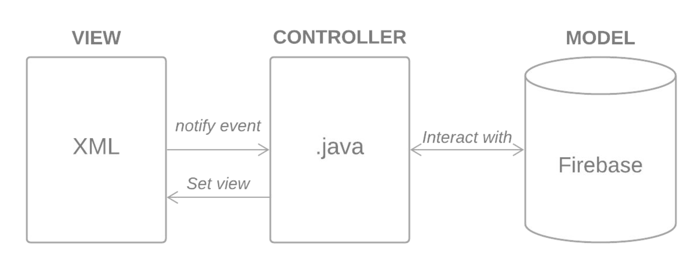


# Database architecture

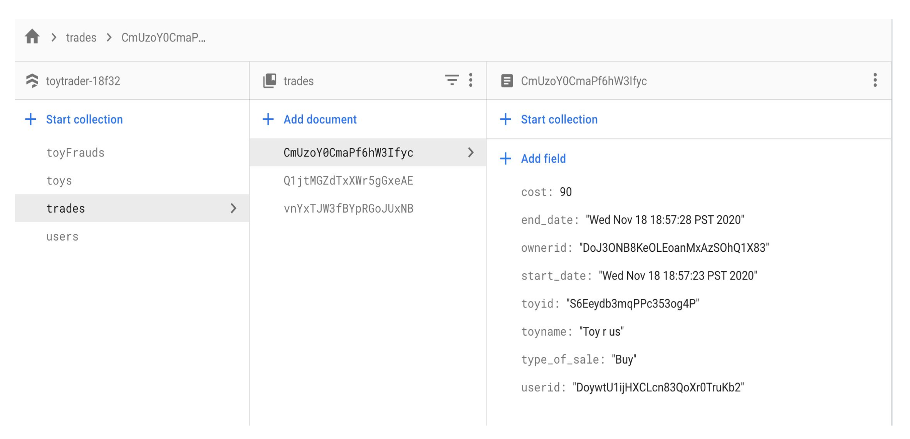

```
● Firebase - Document based NoSQL DB
● Firebase Authentication - Email - Password
● Collections
○ Toys
○ Trades
○ Users
○ Toy-Frauds
```


# Functional Requirements

```
● User can Register
● User can Login
● User can change personal data
● User can view Categories
● User can view Toys
● User can Buy/Rent toys
● User can report Frauds
● User can return a rented toy
● Admin can view users
● Admin can view toys and issues with them
```

# Register

```
● Enter All user details
● Details uploaded to Firebase
● User registered using Firebase Authentication
```
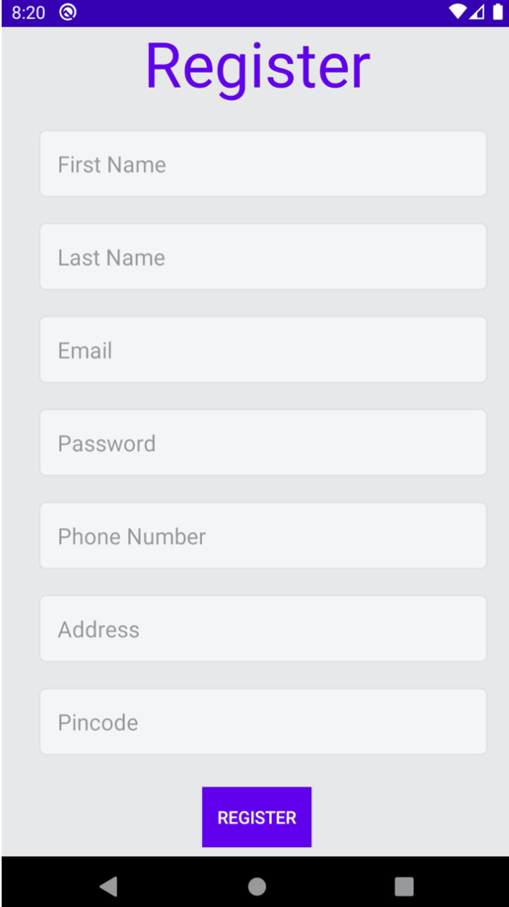

# Login

```
● Enter email and password
● User Authenticated with Firebase Auth
● Securely log into the Application
```
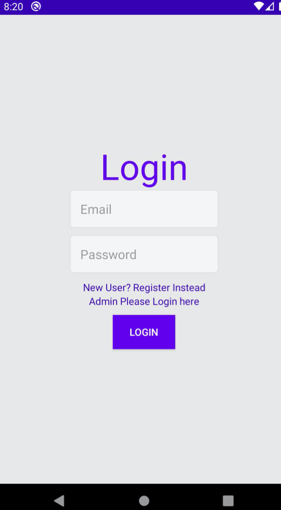

# Home Screen

```
● Home screen for the application
● Select from multiple categories
```
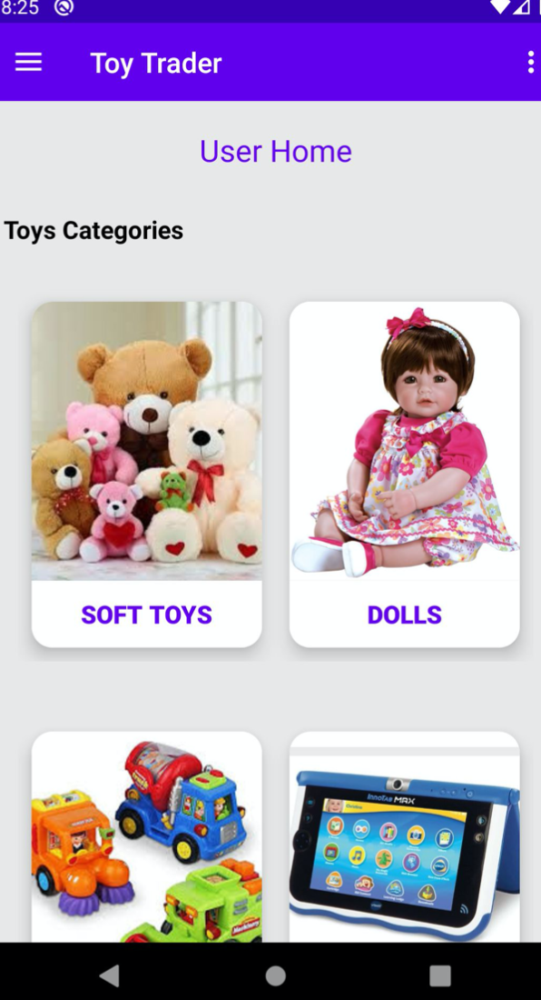

# Upload toy

```
● User can opt to upload their own toys
● Add a few details with the image and you’re good to go
```
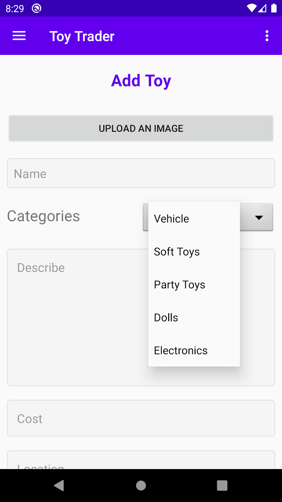

# Categories

```
● User can select any category
● Toys related to that category will be shown here
● Images are downloaded from firebase storage
```
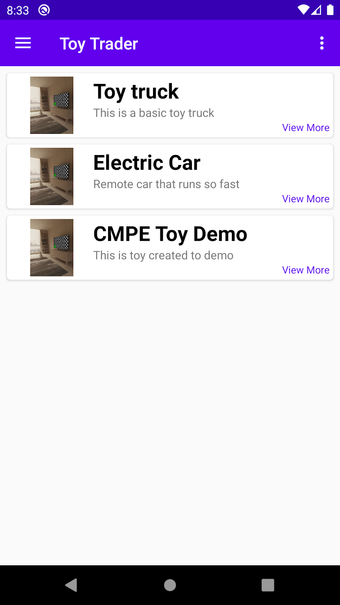

# Toy Description

```
● Selecting any toy opens up detail view
● All the details related to that Toy are shown here
● User can
○ Add the toy to cart
○ Report the toy
○ View Toy location on Map
```
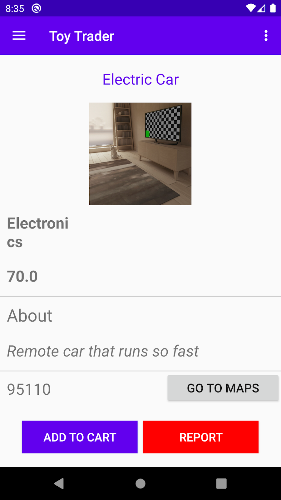

# Map

```
● Map view to show the location on the map
```
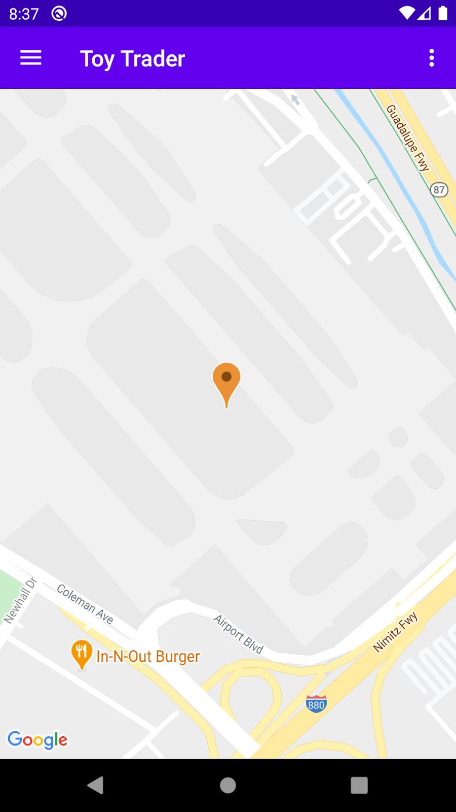

# Cart

```
● After the Item is added to cart user can
○ Buy the item
○ Rent the item
○ Remove the item
```
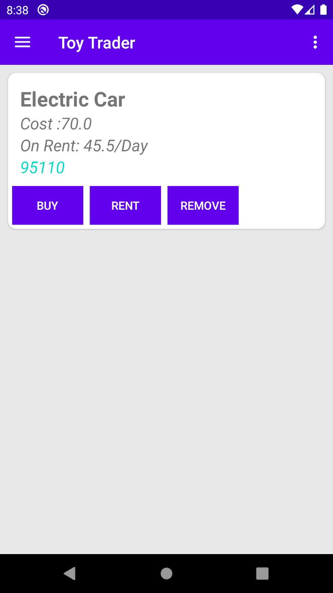

# Orders

```
● Orders page to provide user history
● User can view all the items that he has rented or bought
```
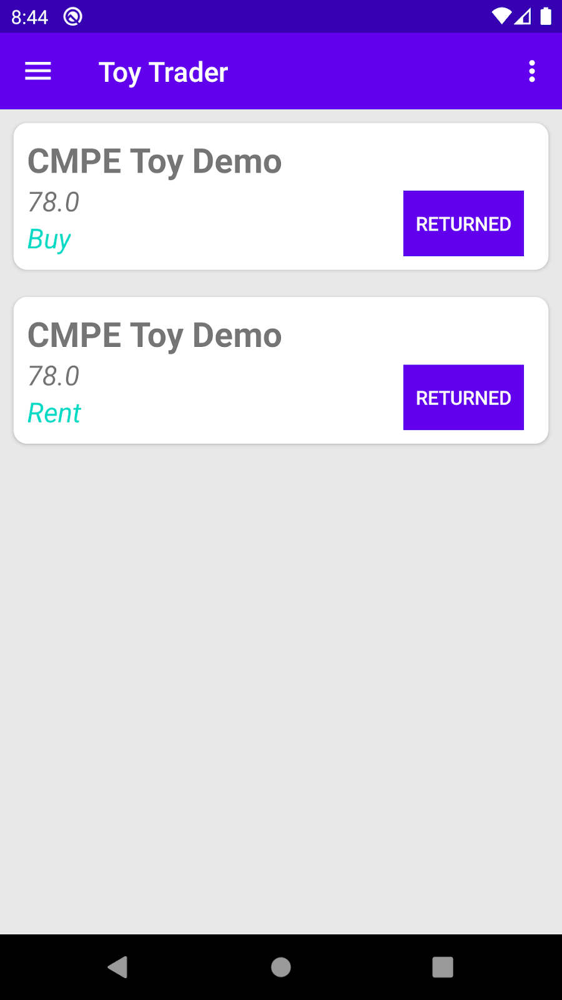

# Profile

```
● Profile page for the logged in user
● View all user details
● Can edit details
● Can change Password
```
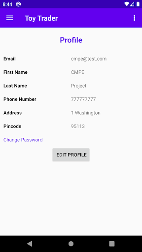

# Admin

```
● Admin portal is used to manage
○ Toys
○ Users
○ Issues reported by Users
```
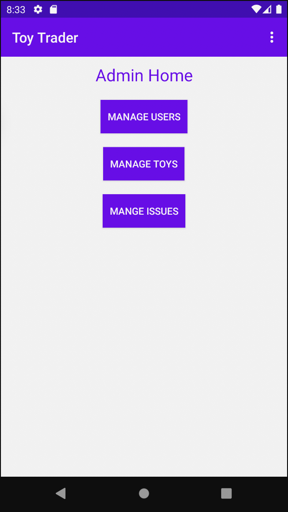

# Admin -

# Manage Users

```
● Admin Can Block the user
● Admin can Delete the user
```
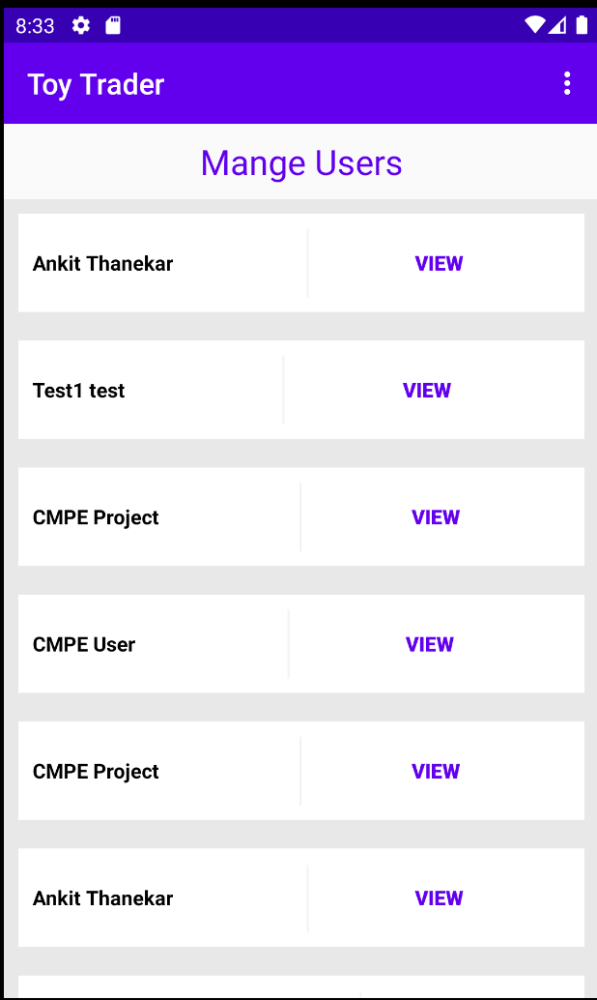

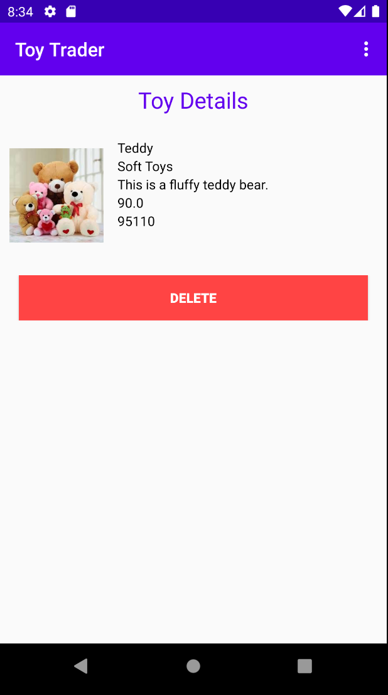

# Admin -

# Manage Toys

```
● Admin can view list of toys
● Admin can delete the toy
```
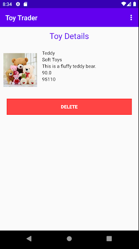

# Admin -

# Manage Issues

```
● Admin can view the reported issues
```
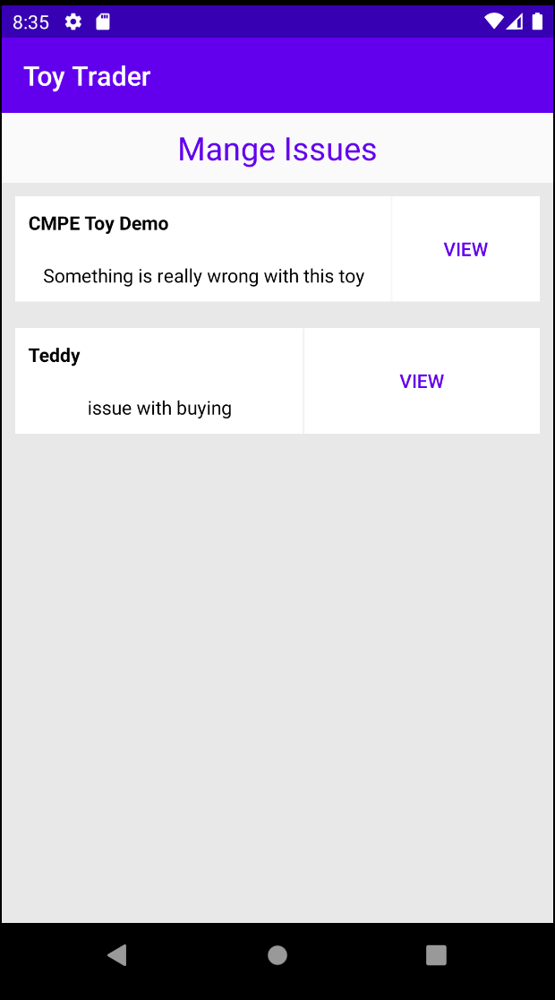

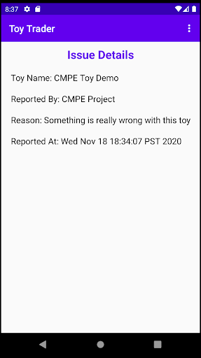

